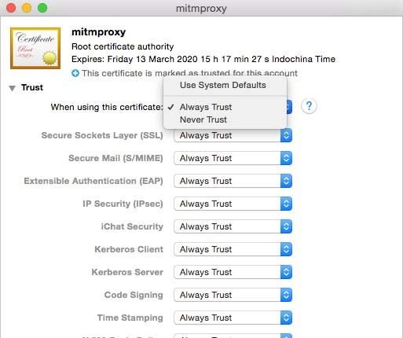
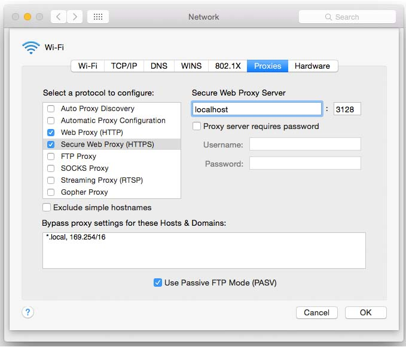
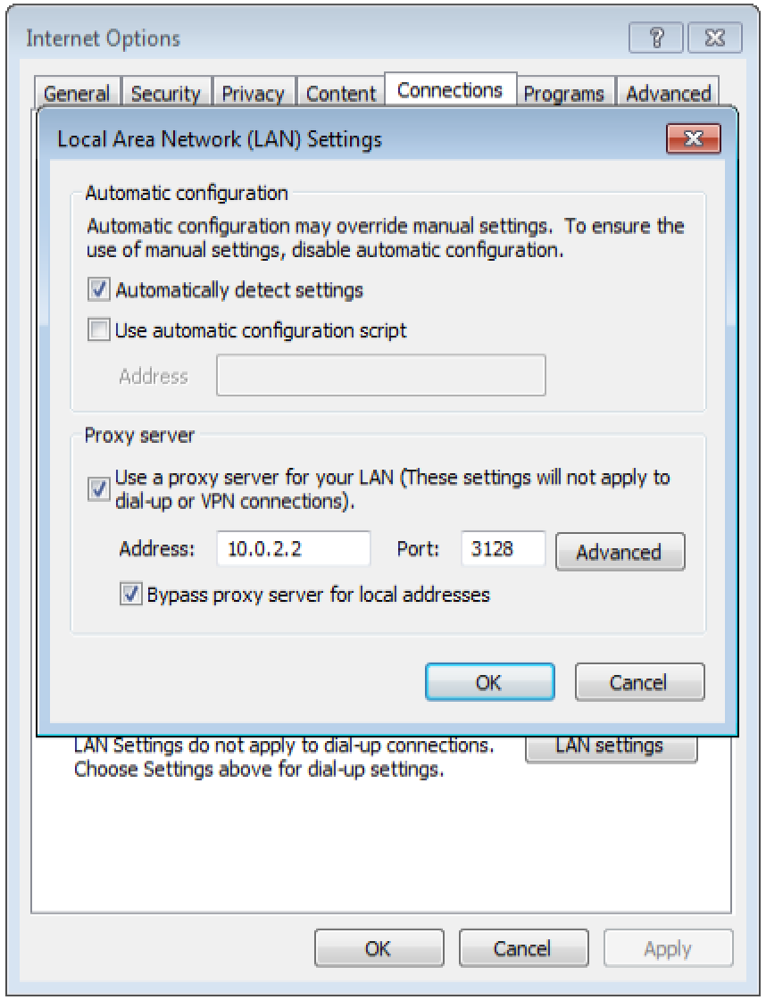
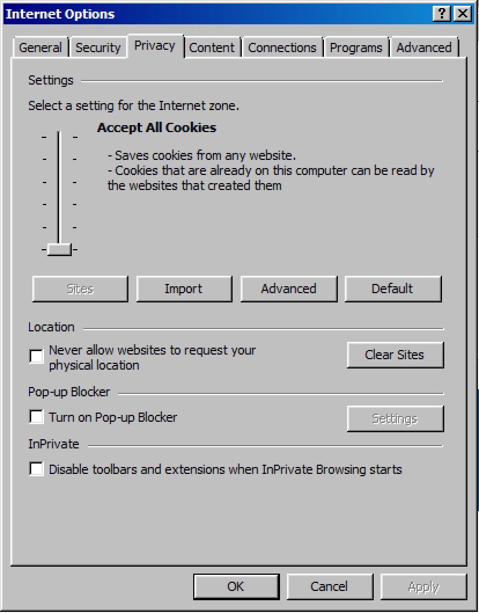
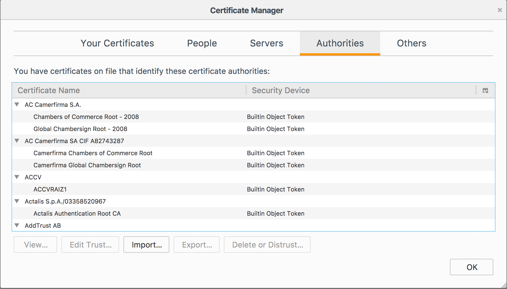

## First time requirements

The web client does not come with its own Vagrant machine to build therefore you have to setup your dev environment manually.
No worries though this process is pretty straightforward.

Make sure you are using the required Node version specified in `package.json`:

```bash
cat package.json | grep \"node\"
```

Make sure your npm is up to date:

```bash
npm install -g yarn
```

Clone the `grape-web-client` repo and install the dependencies:

```bash
git clone git@github.com:ubergrape/grape-web-client.git
cd grape-web-client
npm i
```

## Development

Start a local dev server:

```bash
yarn start:dev
```

This will start a local server at `0.0.0.0:8080` that will serve your assets to the prod app.

In another console session start a local web proxy:

```bash
yarn start:proxy
```

This will start a local web proxy at `0.0.0.0:3128` that redirects the assets of a chatgrape installation to the
local assets. This is currently hard coded to support `staging` and `dev` instances.

To access embedded version of Grape, go to `http://localhost:8081/demo/embedded.html`
In `demo/embedded.html`, change `serviceUrl` parameter to your `stage` or `dev` instance.

To resolve CORS errors (Windows, IE, VirtualBox), please follow [this](https://www.webdavsystem.com/ajax/programming/cross_origin_requests) guide. If it didn't help - try [this](https://answers.microsoft.com/en-us/ie/forum/ie11-iewindows_10/cannot-watch-videos-on-internet-explorer-11/a3253887-b5c5-424c-91c1-ec9ed4b73b01).

On your first run, the certificate `.http-mitm-proxy/certs/ca.pem` is created. You have to
install and trust this certificate using your standard OS tools.

Also install the `ca/chatgrape-labs.pem` certificate.



In order to use the web proxy you have to change your network settings to use
the web proxy for both http and https.

#### For Mac



#### For Windows (IE)

To access localhost in VirtualBox machine (from Mac), use: 10.0.2.2:8081

To test embedded client - http://10.0.2.2:8081/demo/embedded.html (proxy disabled in Windows)
To test full client - https://uebergrape.staging.chatgrape.com/chat (peoxy enabled for Windows)

In case of testing full web-client you may need to install certificates. Please you [this](https://superuser.com/a/1032179) answer install them.

For embedded client in demo/embedded.html use `staticBaseUrl: 'http://10.0.2.2:8081/static/'`.

Enable proxy in IE:



Allow all of cookies in IE:



## Trusting certificate on Firefox

Firefox doesn't trust the trusted system certificate, you need to add it as an authority additionally.

Add all certificates here manually.



## Trusting certificate on Windows

1.  Open shell as an admin (right click in start menu).
1.  Install both certificates using `certutil –addstore -enterprise –f “Root” <pathtocertificatefile>``

## Parallels

You can use your Mac's public IP address and default bridged network adapter to configure the proxy instead of 0.0.0.0.

## Build once

```bash
yarn build
```

## Develop dependencies like grape-web, grape-browser or aurora-ui locally

You can use `yarn link` to switch to the specific package and use it locally.

```sh
cd <your_path>/grape-browser
yarn link

cd <your_path>/grape-web-client
yarn link grape-browser
yarn run start:dev:all # node_modules are cached! restart this process if it was already running

# in a second terminal
cd <your_path>/grape-browser
yarn run build:watch
```

Ideally the package has a `build:watch` script so you do not constantly need to re-run the build. If not please add one.

for **aurora-ui**, be sure to link the `web` directory:

```sh
cd <your_path>/grape-ds/web
yarn link

cd <your_path>/grape-web-client
yarn link aurora-ui
yarn start:dev:all # node_modules are cached! restart this process if it was already running

# in a second terminal
cd <your_path>/grape-ds/web
yarn build:lib:watch
```
